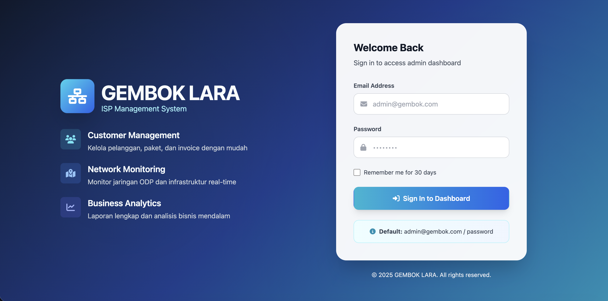
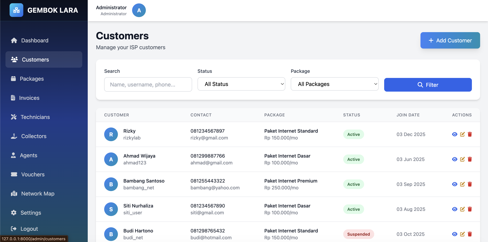

# 🔐 GEMBOK LARA - ISP Billing & Management System


**GEMBOK LARA** adalah sistem manajemen tagihan dan operasional ISP (Internet Service Provider) yang dibangun menggunakan **Laravel 12**. Sistem ini dirancang dengan antarmuka modern, analitik mendalam, dan fitur lengkap untuk mengelola bisnis ISP Anda.

🌐 **Demo**: [https://isp.digitalkanaku.com/](https://isp.digitalkanaku.com/)

---

## � Screenshots

<div align="center">
  
  
  
  
</div>

> **Note**: Screenshot aplikasi tersedia di folder `img/`

---

## ✨ Fitur Lengkap

### 🎨 **Modern UI/UX**
- **Theme ISP Network**: Desain modern dengan warna cyan & biru yang profesional
- **Responsive Design**: Tampilan optimal di desktop, tablet, dan mobile
- **Dark Sidebar**: Sidebar dengan gradient elegan dan navigasi intuitif
- **Interactive Charts**: Grafik analitik menggunakan Chart.js
- **Smooth Animations**: Transisi dan hover effects yang halus

### 📊 **Dashboard Analytics**
- **Real-time Statistics**: 
  - Total Customers & Active Status
  - Total Revenue & Pending Revenue
  - Package Distribution
  - Invoice Status
- **Interactive Charts**:
  - Revenue Trend (6 bulan terakhir)
  - Customer Growth Chart
  - Package Distribution (Doughnut Chart)
  - Invoice Status (Pie Chart)
- **Recent Activity**: Invoice dan customer terbaru
- **Quick Actions**: Akses cepat ke fitur utama

### 👥 **Customer Management**
- **CRUD Lengkap**: Create, Read, Update, Delete customer
- **Customer Profile**: Detail lengkap dengan statistik
- **Package Assignment**: Assign paket internet ke customer
- **Status Management**: Active, Inactive, Suspended
- **Search & Filter**: Pencarian dan filter berdasarkan status/paket
- **Invoice History**: Riwayat tagihan per customer

### 💰 **Invoice & Billing**
- **Auto Invoice Generation**: Generate invoice otomatis
- **Invoice Management**: Create, edit, view, print invoice
- **Payment Tracking**: Status paid/unpaid dengan tanggal bayar
- **Invoice Filtering**: Filter berdasarkan status, customer, tanggal
- **Professional Print**: Template invoice untuk print
- **Revenue Analytics**: Statistik pendapatan real-time

### 📦 **Package Management**
- **Flexible Packages**: Buat paket dengan harga dan kecepatan custom
- **Package Statistics**: Jumlah subscriber per paket
- **Tax Configuration**: Pengaturan pajak per paket
- **PPPoE Profile**: Mapping ke profil Mikrotik
- **Active/Inactive Status**: Kontrol paket yang ditampilkan

### 🎫 **Voucher System**
- **Voucher Purchase**: Sistem pembelian voucher online
- **Pricing Management**: Harga customer vs agen
- **Generation Settings**: Konfigurasi format voucher
- **Online Settings**: Durasi dan profil voucher
- **Delivery Logs**: Tracking pengiriman voucher
- **Sales Analytics**: Statistik penjualan voucher

### 🌐 **Network Management**
- **ODP Management**: Database Optical Distribution Point
- **Interactive Map**: Peta jaringan dengan Leaflet.js
- **Capacity Monitoring**: Visualisasi port usage
- **GPS Coordinates**: Lokasi ODP dengan koordinat
- **Status Tracking**: Active, Maintenance, Full
- **Cable Routes**: Manajemen rute kabel per customer
- **ONU Devices**: Database perangkat ONU
- **Network Segments**: Manajemen segmen jaringan
- **Maintenance Logs**: Riwayat maintenance infrastruktur

### � **O*LT Management** (NEW v1.3.0)
- **OLT Dashboard**: Monitoring semua OLT dengan statistik ONU
- **ONU Status**: Real-time status (Online, Offline, LOS, DyingGasp)
- **Optical Signal**: RX/TX Power monitoring dengan indikator kualitas
- **Hardware Monitoring**: Temperature dan Fan speed (RPM)
- **PON Port Management**: Status dan kapasitas per port
- **ONU Actions**: Reboot, status update, customer assignment
- **Status History**: Tracking perubahan status ONU
- **Search & Filter**: Cari ONU berdasarkan SN, MAC, customer

### 👨‍💼 **Agent System**
- **Agent Management**: CRUD agen penjualan
- **Balance System**: Manajemen saldo deposit agen
- **Transaction History**: Riwayat transaksi lengkap
- **Balance Requests**: Sistem request topup saldo
- **Voucher Sales**: Tracking penjualan voucher per agen
- **Commission System**: Perhitungan komisi otomatis
- **Monthly Payments**: Pembayaran bulanan via agen
- **Notifications**: Sistem notifikasi untuk agen

### 🛠️ **Staff Management**
- **Technicians**: Manajemen teknisi lapangan
- **Collectors**: Manajemen kolektor pembayaran
- **Area Coverage**: Pembagian area kerja
- **Performance Tracking**: Monitoring kinerja staff

### ⚙️ **System Settings**
- **Company Profile**: Konfigurasi data perusahaan
- **Payment Gateway**: Integrasi Midtrans/Xendit
- **WhatsApp Gateway**: Notifikasi otomatis via WA
- **Email Configuration**: Setup SMTP untuk email
- **System Preferences**: Pengaturan umum sistem

### 🔌 **Mikrotik Integration**
- **PPPoE Management**: Auto create/update/delete secrets, profile mapping, disconnect users
- **Hotspot Management**: User sessions, active connections, traffic monitoring
- **System Monitoring**: CPU, memory, uptime, interface statistics
- **Auto-sync**: Customer credentials sync with Mikrotik on create/update

### 📡 **GenieACS CPE Management**
- **Device Management**: List, view details, status monitoring (online/offline)
- **Remote Control**: Reboot, factory reset, refresh data, WiFi settings
- **Bulk Operations**: Bulk reboot, bulk refresh for multiple devices
- **TR-069 Protocol**: Full CWMP support for CPE provisioning

### 🛡️ **RADIUS Server Integration**
- **User Management**: Create, update, delete RADIUS users
- **Group/Profile**: Bandwidth profiles with rate limits
- **Session Monitoring**: Online users, session history (radacct)
- **CoA Support**: Disconnect and suspend/unsuspend users

### 📊 **SNMP Network Monitoring**
- **Device Monitoring**: System info, uptime, description
- **Traffic Statistics**: Interface in/out bandwidth (bps)
- **Resource Usage**: CPU and memory monitoring
- **Connectivity**: Ping and status checks

### 🔗 **CRM Integration**
- **Providers**: HubSpot, Salesforce, Zoho CRM
- **Features**: Contact sync, deal creation, activity logging
- **Bulk Sync**: Sync all customers to CRM

### 💼 **Accounting Integration**
- **Providers**: Accurate Online, Jurnal.id, Zahir
- **Features**: Customer sync, invoice sync, payment recording
- **Bulk Sync**: Sync all data to accounting software

---

## 🗄️ **Database Seeders**

Sistem dilengkapi dengan 23 seeder lengkap untuk data dummy:

### Core Data
- `UserSeeder` - Admin dan staff users
- `AppSettingSeeder` - Konfigurasi aplikasi
- `PackageSeeder` - Paket internet (10-100 Mbps)
- `VoucherPricingSeeder` - Harga voucher

### Staff & Agents
- `TechnicianSeeder` - Data teknisi
- `CollectorSeeder` - Data kolektor
- `AgentSeeder` - Data agen (3 agen)
- `AgentBalanceSeeder` - Saldo agen
- `AgentTransactionSeeder` - Transaksi agen
- `AgentBalanceRequestSeeder` - Request saldo
- `AgentNotificationSeeder` - Notifikasi agen
- `AgentPaymentSeeder` - Pembayaran via agen
- `AgentMonthlyPaymentSeeder` - Pembayaran bulanan
- `AgentVoucherSaleSeeder` - Penjualan voucher

### Network Infrastructure
- `OdpSeeder` - 5 ODP dengan koordinat GPS
- `NetworkSegmentSeeder` - Segmen jaringan
- `CableRouteSeeder` - Rute kabel customer
- `OnuDeviceSeeder` - Perangkat ONU
- `CableMaintenanceLogSeeder` - Log maintenance

### Customers & Billing
- `CustomerSeeder` - 5 customer dummy
- `InvoiceSeeder` - Invoice bulanan

### Voucher System
- `VoucherPurchaseSeeder` - 20 transaksi voucher
- `VoucherGenerationSettingSeeder` - Setting generator
- `VoucherOnlineSettingSeeder` - Setting online (1H-30D)
- `VoucherDeliveryLogSeeder` - Log pengiriman

### Reports
- `MonthlySummarySeeder` - Ringkasan 3 bulan terakhir

**Dokumentasi lengkap**: Lihat `database/seeders/README.md`

---

## 🚀 Instalasi & Setup

### Prasyarat
- PHP >= 8.2
- Composer
- MySQL >= 8.0
- Node.js >= 18.x & NPM

### Langkah Instalasi

1. **Clone Repository**
   ```bash
   git clone https://github.com/rizkylab/gembok-lara.git
   cd gembok-lara
   ```

2. **Install Dependencies**
   ```bash
   composer install
   npm install
   ```

3. **Konfigurasi Environment**
   ```bash
   cp .env.example .env
   php artisan key:generate
   ```
   
   Edit `.env` dan sesuaikan database credentials:
   ```env
   DB_CONNECTION=mysql
   DB_HOST=127.0.0.1
   DB_PORT=3306
   DB_DATABASE=gembok_lara
   DB_USERNAME=root
   DB_PASSWORD=
   ```

4. **Setup Database**
   ```bash
   php artisan migrate:fresh --seed
   ```

5. **Build Assets**
   ```bash
   npm run build
   # atau untuk development
   npm run dev
   ```

6. **Jalankan Server**
   ```bash
   php artisan serve
   ```

Akses aplikasi di: `http://localhost:8000`

---

## 🔑 Akun Demo & Portal Akses

Sistem Gembok Lara memiliki beberapa portal terpisah untuk peran yang berbeda. Berikut adalah URL login beserta akun demo untuk masing-masing portal:

| Portal | URL Login | Email/Username | Password | Fungsi Utama |
|--------|-----------|----------------|----------|--------------|
| **Admin** | `/login` atau `/admin/login` | `admin@gembok.com` | `admin123` | Mengelola seluruh sistem (Customer, Keuangan, Jaringan, Voucher, dll) |
| **Customer** | `/customer/login` | `pppoe-ahmad` atau `081299887766` | `ahmad123` | Portal pelanggan untuk melihat tagihan, membayar invoice, & buat tiket CS |
| **Technician** | `/technician/login` | `asep.tech@gembok.com` | `password` | Portal teknisi untuk melihat map jaringan ODP, rute kabel pelanggan, & jadwal instalasi/perbaikan |
| **Agent** | `/agent/login` | `agen.budi` | `password` | Portal khusus agen voucher untuk melakukan penjualan retail voucher hotspot |
| **Collector** | `/collector/login` | `kolektor.anto` | `password` | Portal khusus penagih/kolektor untuk update status pembayaran tunai pelanggan |

> **Note**:
> - Customer dapat login menggunakan *PPPoE username*, *username*, *nomor HP*, atau *email*.
> - Installer/Teknisi bisa menggunakan username atau alamat emailnya.
> - Default password untuk entitas yang dibuat dari menu admin (seperti teknisi/agen/kolektor) adalah `password`.

---

## 🛠️ Tech Stack

### Backend
- **Laravel 12** - PHP Framework
- **MySQL 8** - Database
- **Eloquent ORM** - Database abstraction

### Frontend
- **Blade Templates** - Templating engine
- **Tailwind CSS 3** - Utility-first CSS
- **Alpine.js** - Lightweight JavaScript
- **Chart.js 4** - Interactive charts
- **Leaflet.js** - Interactive maps
- **Font Awesome 6** - Icon library

### Tools & Libraries
- **Vite** - Frontend build tool
- **Composer** - PHP dependency manager
- **NPM** - JavaScript package manager

---

## 📁 Struktur Proyek

```
gembok-lara/
├── app/
│   ├── Http/Controllers/Admin/  # Controllers
│   ├── Models/                   # Eloquent Models
│   └── Providers/                # Service Providers
├── database/
│   ├── migrations/               # Database migrations
│   └── seeders/                  # Database seeders
├── resources/
│   ├── views/admin/              # Blade templates
│   ├── css/                      # Stylesheets
│   └── js/                       # JavaScript
├── routes/
│   └── web.php                   # Route definitions
├── public/                       # Public assets
└── img/                          # Screenshots
```

---

## 🔒 Keamanan

GEMBOK LARA dibangun dengan standar keamanan Laravel:

- ✅ **Authentication** - Session-based dengan Bcrypt hashing
- ✅ **CSRF Protection** - Token pada semua form
- ✅ **SQL Injection Protection** - Eloquent ORM binding
- ✅ **XSS Protection** - Blade auto-escaping
- ✅ **Input Validation** - Validasi ketat pada semua input
- ✅ **Password Hashing** - Bcrypt dengan salt
- ✅ **Secure Headers** - HTTP security headers

---

## 🔄 CI/CD Pipeline

Proyek ini menggunakan **GitHub Actions** dengan security checks otomatis sebelum deployment.

### Pipeline Flow
```
Push/PR → Security Scans → Tests → Security Gate → Deploy to VPS
```

### Security Checks

#### SAST (Static Application Security Testing)
| Tool | Fungsi |
|------|--------|
| **PHPStan** | Static analysis untuk PHP (level 5) |
| **Psalm** | Taint analysis untuk deteksi SQL injection, XSS |
| **Semgrep** | Pattern-based security scanning |
| **CodeQL** | GitHub's advanced security analysis |

#### Dependency Vulnerability Scan
| Tool | Fungsi |
|------|--------|
| **Composer Audit** | Scan vulnerabilities di PHP packages |
| **PHP Security Checker** | Symfony security advisories |
| **NPM Audit** | Scan vulnerabilities di JavaScript packages |

### Workflow Triggers
- **Push ke `main`**: Full pipeline + deploy ke VPS
- **Push ke `dev`**: Security checks + tests (tanpa deploy)
- **Pull Request**: Security checks + tests

### Deployment
- Auto-deploy ke VPS via SSH setelah semua security checks pass
- Laravel optimization (config/route/view cache)
- Zero-downtime deployment

### Dependabot
- Auto-update dependencies setiap minggu (Senin)
- Monitoring: Composer, NPM, GitHub Actions

Lihat detail konfigurasi di `.github/workflows/ci-security.yml`

---

## 🗺️ Roadmap & Progress

### Phase 1 - Core System ✅ 100% Complete
| Feature | Status | Description |
|---------|--------|-------------|
| Customer Management | ✅ | CRUD, search, filter, status management |
| Package Management | ✅ | Pricing, bandwidth, PPPoE profile mapping |
| Invoice & Billing | ✅ | Auto-generate, print, payment tracking |
| Agent System | ✅ | Balance, transactions, voucher sales |
| Staff Management | ✅ | Technicians, collectors, area coverage |
| Voucher System | ✅ | Pricing, generation, online settings |
| Network Infrastructure | ✅ | ODP, cable routes, ONU devices |
| Analytics Dashboard | ✅ | Charts, statistics, real-time data |
| Modern UI/UX | ✅ | Tailwind CSS, responsive, dark sidebar |

### Phase 2 - Integration ✅ 100% Complete
| Feature | Status | Description |
|---------|--------|-------------|
| Mikrotik PPPoE | ✅ | Auto-sync secrets, profiles, disconnect |
| Mikrotik Hotspot | ✅ | User management, active sessions |
| GenieACS CPE | ✅ | TR-069, reboot, WiFi config, bulk ops |
| WhatsApp Gateway | ✅ | Fonnte/WaBlas, invoice notif, reminders |
| Payment Gateway | ✅ | Midtrans & Xendit, webhooks, auto-activate |
| Public Order System | ✅ | Package selection, payment, tracking |

### Phase 3 - Advanced Features ✅ 100% Complete
| Feature | Status | Description |
|---------|--------|-------------|
| Customer Portal | ✅ | Dashboard, invoices, payments, tickets, usage, profile |
| Agent Portal | ✅ | Voucher sales, balance, transactions |
| Collector Portal | ✅ | Invoice collection, payment processing |
| Technician Portal | ✅ | Tasks, installations, repairs, map |
| API Documentation | ✅ | Customer & Admin REST API |
| Advanced Reporting | ✅ | Daily/monthly reports, multi-format export |
| Automated Billing | ✅ | Auto-generate, reminders, suspend, reactivate |
| Public Voucher Store | ✅ | Online purchase, WhatsApp delivery |
| GUI Integration Settings | ✅ | Mikrotik, RADIUS, GenieACS, WhatsApp, Midtrans, Xendit |

### Phase 4 - Enterprise Features ✅ 100% Complete
| Feature | Status | Description |
|---------|--------|-------------|
| RADIUS Server | ✅ | FreeRADIUS, user/group management, CoA |
| SNMP Monitoring | ✅ | Device status, traffic, CPU/memory |
| Ticketing System | ✅ | Categories, priorities, assignments |
| CRM Integration | ✅ | HubSpot, Salesforce, Zoho sync |
| Accounting Integration | ✅ | Accurate, Jurnal, Zahir sync |
| Multi-language | ✅ | English & Indonesian, language switcher |

### Phase 5 - Future Enhancements 📋 Planned
| Feature | Status | Description |
|---------|--------|-------------|
| Mobile App | 📋 | Flutter-based mobile application |
| Multi-tenant | 📋 | Support multiple ISP companies |
| SMS Gateway | 📋 | SMS notification integration |
| Email Marketing | 📋 | Promotional email campaigns |
| SLA Monitoring | 📋 | Service level agreement tracking |

---

## 📝 Changelog

### Version 1.3.0 (Current - December 2025)
- ✅ OLT Management System for FTTH network monitoring
- ✅ ONU status monitoring (Online, Offline, LOS, DyingGasp)
- ✅ Optical signal monitoring (RX/TX Power, Temperature, Voltage)
- ✅ Fan status and temperature monitoring for OLT
- ✅ ONU reboot and status history tracking
- ✅ Customer assignment to ONU devices
- ✅ Customer portal login with PPPoE credentials
- ✅ GUI Integration Settings for all services (Mikrotik, RADIUS, GenieACS, WhatsApp, Midtrans, Xendit)

### Version 1.2.0 (December 2025)
- ✅ RADIUS Server Integration (FreeRADIUS)
- ✅ SNMP Network Monitoring
- ✅ CRM Integration (HubSpot/Salesforce/Zoho)
- ✅ Accounting Integration (Accurate/Jurnal/Zahir)
- ✅ Ticketing System with priorities & assignments
- ✅ Multi-language Support (EN/ID)
- ✅ Customer Portal (tickets, usage monitoring)
- ✅ Advanced Reporting (daily/monthly, CSV/JSON export)
- ✅ Automated Billing (auto-reactivate, WhatsApp reports)
- ✅ REST API with documentation

### Version 1.1.0 (November 2025)
- ✅ Mikrotik PPPoE & Hotspot Integration
- ✅ GenieACS CPE Management (TR-069)
- ✅ WhatsApp Gateway Integration
- ✅ Payment Gateway (Midtrans/Xendit)
- ✅ Multi-Portal System (Customer, Agent, Collector, Technician)
- ✅ Public Order & Voucher Store

### Version 1.0.0 (October 2025)
- ✅ Complete CRUD for all modules
- ✅ Modern UI with Cyan/Blue theme
- ✅ Interactive dashboard with Chart.js
- ✅ Network map with Leaflet.js
- ✅ 23 database seeders with realistic data
- ✅ Fully responsive design
- ✅ Print-ready invoice template
- ✅ Agent management system
- ✅ Voucher system
- ✅ ODP & network management
- ✅ Customer detail with statistics
- ✅ Revenue & growth analytics

---

## 🤝 Kontribusi

Kami sangat menghargai kontribusi Anda!

1. Fork repository
2. Buat branch baru (`git checkout -b feature/AmazingFeature`)
3. Commit perubahan (`git commit -m 'Add some AmazingFeature'`)
4. Push ke branch (`git push origin feature/AmazingFeature`)
5. Buat Pull Request

---

## 💬 Dukungan

- **Issues**: [GitHub Issues](https://github.com/rizkylab/gembok-lara/issues)
- **Discussions**: [GitHub Discussions](https://github.com/rizkylab/gembok-lara/discussions)

---

## ☕ Support Project

Jika proyek ini bermanfaat untuk Anda, pertimbangkan untuk memberikan dukungan:

<a href="https://saweria.co/rizkylab" target="_blank">
  
</a>

Dukungan Anda membantu pengembangan fitur baru dan maintenance proyek ini. Terima kasih! 🙏

---

## 📄 License

Proyek ini dilisensikan di bawah **MIT License**. Lihat file `LICENSE` untuk detail.

---

## 🙏 Acknowledgments

Proyek ini terinspirasi dari:
- **[Gembok Bill](https://github.com/alijayanet/gembok-bill)** oleh Ali Jaya Net

Terima kasih kepada:
- Laravel Community
- Tailwind CSS Team
- Chart.js Contributors
- Leaflet.js Team

---

## 📞 Contact

**Developer**: Rizky Lab  
**Email**: rizkylab@gmail.com 
**GitHub**: [@rizkylab](https://github.com/rizkylab)

---

<div align="center">
  <strong>GEMBOK LARA</strong> - <em>Simplifying ISP Management</em>
  <br><br>
  Made with ❤️ using Laravel & Tailwind CSS
</div>
